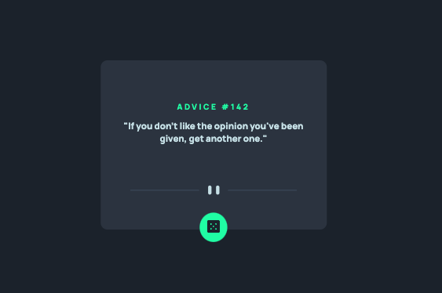

# Frontend Mentor - Advice generator app solution

This is a solution to the [Advice generator app challenge on Frontend Mentor](https://www.frontendmentor.io/challenges/advice-generator-app-QdUG-13db). Frontend Mentor challenges help you improve your coding skills by building realistic projects.

## Table of contents

- [Overview](#overview)
- [Screenshots](#screenshot)
- [Links](#links)
- [Built with](#built-with)
- [Continued development](#continued-development)
- [Useful resources](#useful-resources)
- [Author](#author)

## Overview

This challenge is to build out an advice generator app using the [Advice Slip API](https://api.adviceslip.com). It will display the Advice #, and advice text upon loading the page.

Users should be able to:

- View the optimal layout for the app depending on their device's screen size
- See hover states for all interactive elements on the page
- Generate a new piece of advice by clicking the dice icon

### Screenshots

### Links

- Solution URL: (https://www.frontendmentor.io/solutions/advice-generator-app-0TwmnwnUJO)
- Live Site URL: (https://rachelpr.github.io/advice-generator/)

### Built with

- Semantic HTML5 markup
- CSS custom properties
- Flexbox
- Mobile-first workflow
- Javascript

### Continued development

- Perfecting and tweaking the design
- Refactoring app.js to optimize loading
- Perhaps React rebuild

### Useful resources

- [Stackoverflow thread about button reloading the page](https://stackoverflow.com/questions/29884654/button-that-refreshes-the-page-on-click) - This helped me refresh some learning about onClick abilities.
- [Coolors.co](https://coolors.co/4f5d74-1f2632-323a49-4e5d73) - This site is amazing for finding colours. It helped me figure out which colours go in which spot.

## Author

- Frontend Mentor - [@rachelpr](https://www.frontendmentor.io/profile/rachelpr)
- Github - [@rachelpr](https://github.com/rachelpr)
